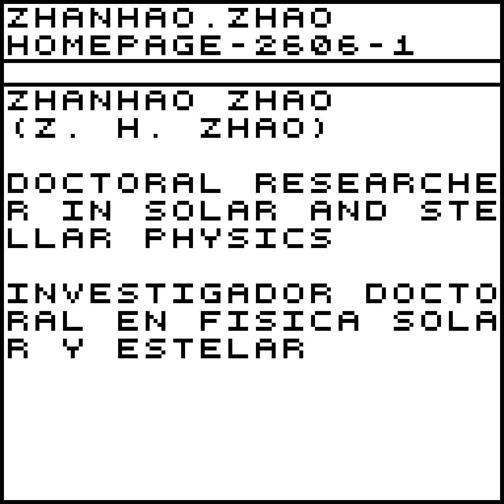
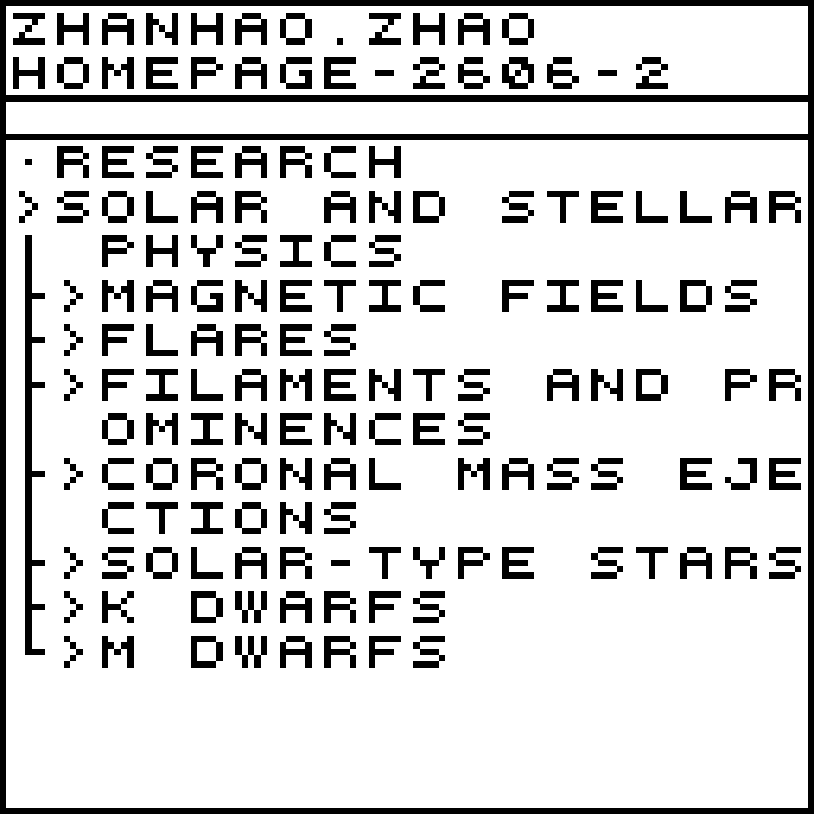
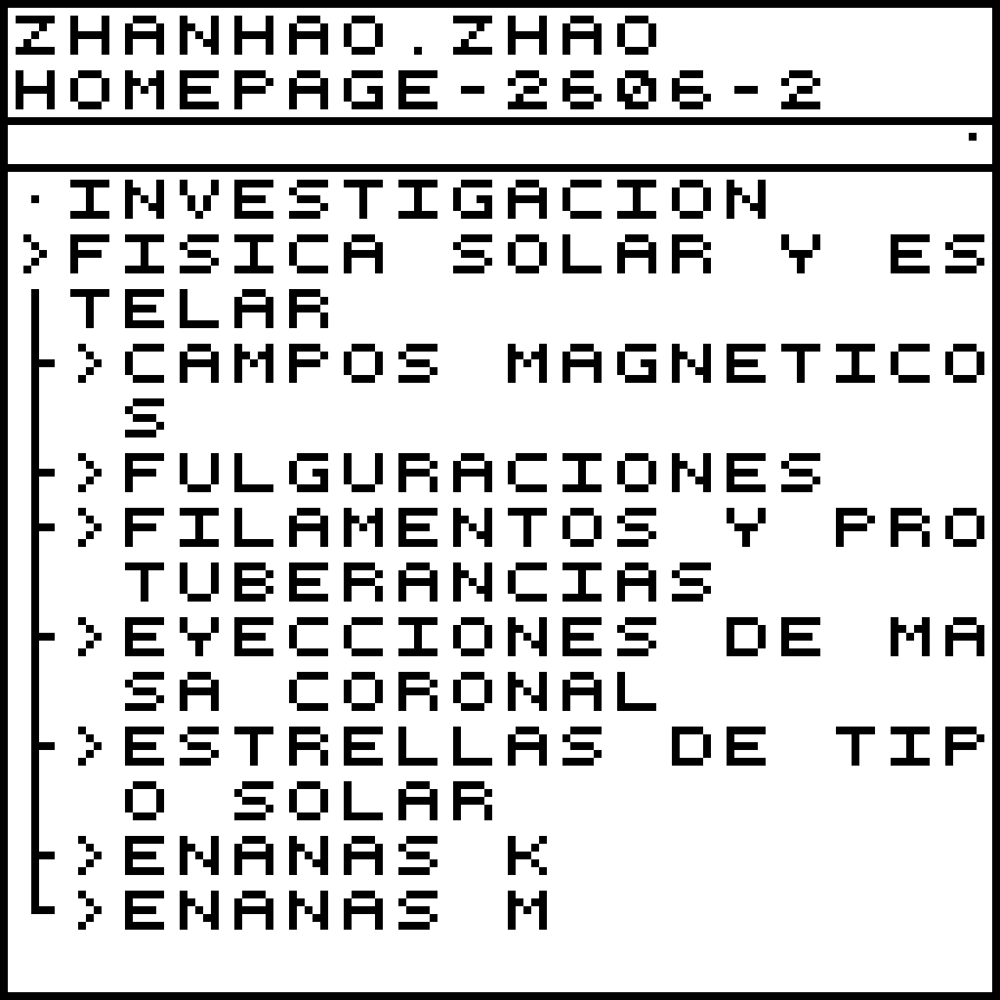
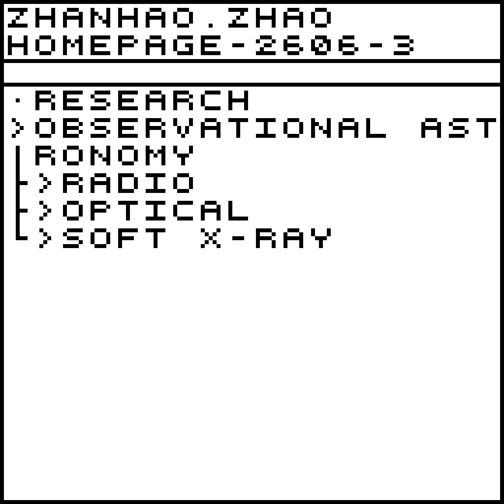
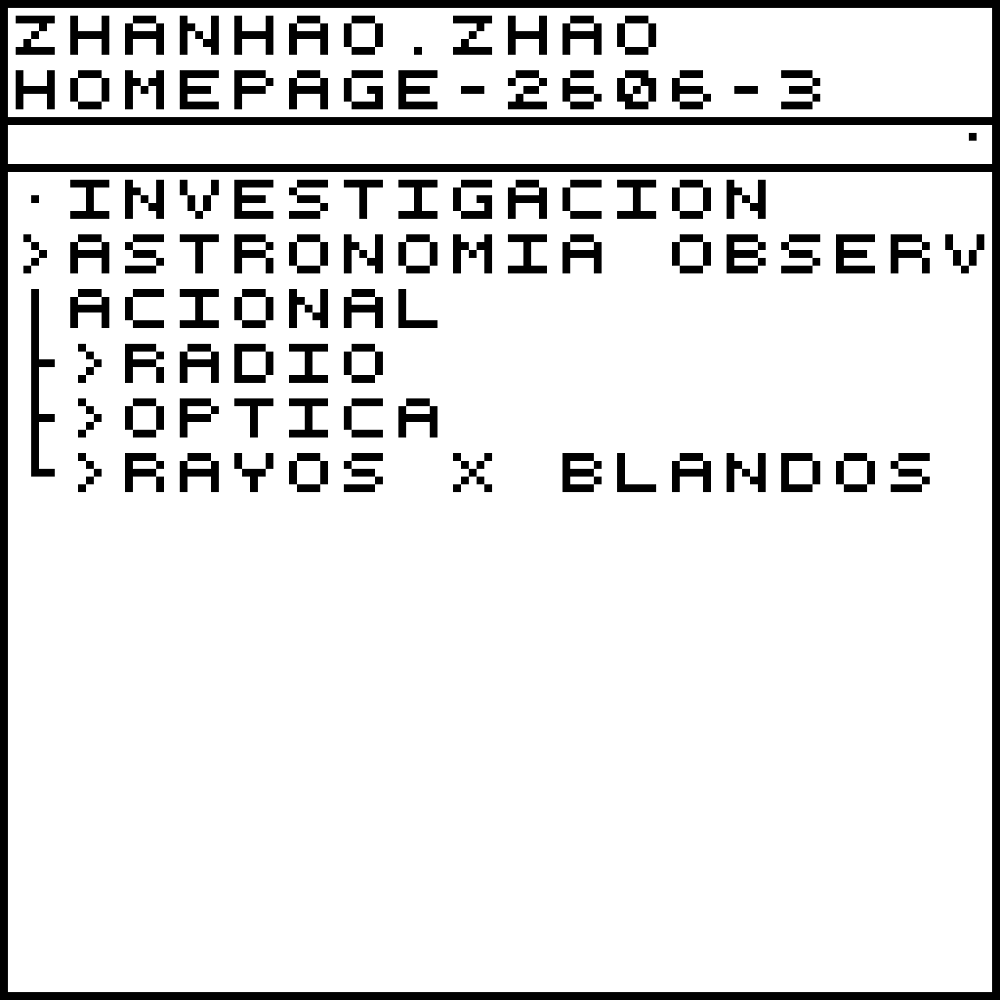
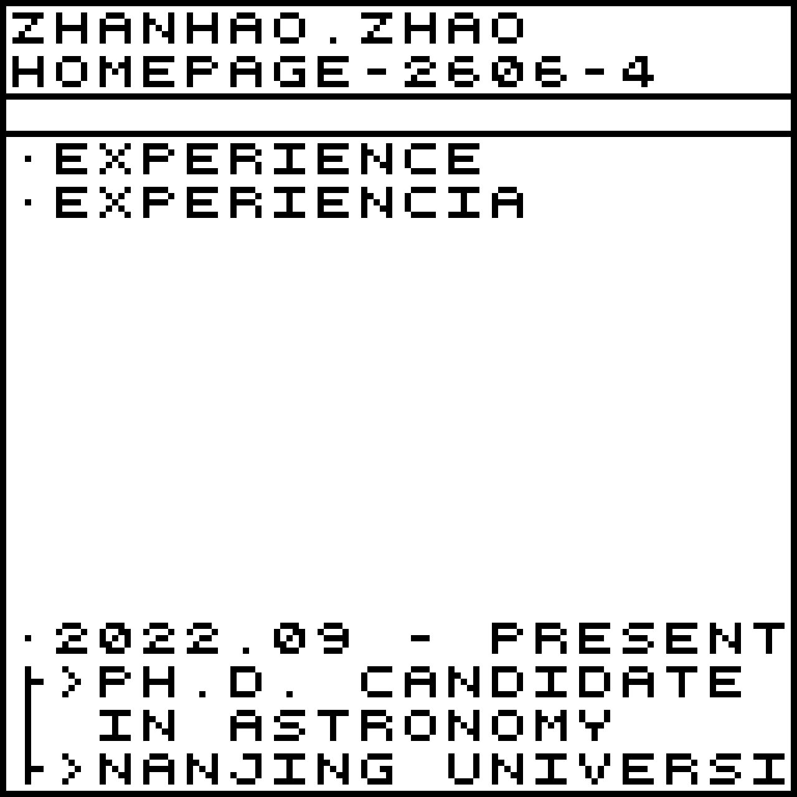
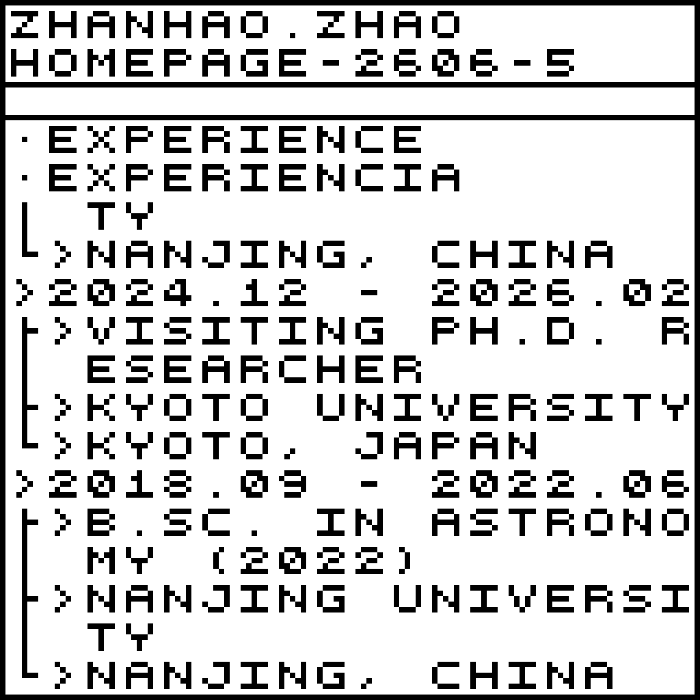

<table>
  <tr>
    <td width="50%">
    
    </td>
    <td width="50%">
    
    </td>
  </tr>
  <tr>
    <td width="50%">
    
    </td>
    <td width="50%">
    
    </td>
  </tr>
  <tr>
    <td width="50%">
    
    </td>
    <td width="50%">
    
    </td>
  </tr>
</table>

<pre>
· CONTACT | CONTACTO

> EMAIL | CORREO ELECTRÓNICO: ASTRO.Z.H.ZHAO_AT_GMAIL.COM (PLEASE REPLACE "_AT_" WITH "@".)
> HOMEPAGE | PÁGINA PERSONAL: HTTPS://GITHUB.COM/ASTROZZH
> AFFILIATION | AFILIACIÓN: SCHOOL OF ASTRONOMY AND SPACE SCIENCE, NANJING UNIVERSITY
> ADDRESS | DIRECCIÓN: NANJING UNIVERSITY (XIANLIN CAMPUS), NANJING, CHINA
> LOCATION | UBICACIÓN: EARTH, SOLAR SYSTEM | TIERRA, SISTEMA SOLAR
</pre>

<pre>
· NEWS | NOTICIAS

[2026.07] MY PERSONAL ACADEMIC HOMEPAGE IS NOW ONLINE. 
</pre>

<pre>
· PUBLICATIONS | PUBLICACIONES

> FIRST-AUTHOR PUBLICATIONS | PUBLICACIONES COMO PRIMER AUTOR

[1] 
[Zhao, Z. H.]; Hua, Z. Q.; Cheng, X.; et al. (2024) The Astrophysical Journal, 961, 130. 
A Statistical Study of Soft X-Ray Flares on Solar-type Stars
ADS: https://ui.adsabs.harvard.edu/abs/2024ApJ...961..130Z/abstract 
DOI: 10.3847/1538-4357/ad09d7

> COLLABORATIVE PUBLICATIONS | PUBLICACIONES EN COLABORACIÓN

[3] 
Zhou, Ping; Mao, Jirong; Zhang, Liang; ...; [Zhao, Zhanhao]; et al. (2025) Science China Physics, Mechanics & Astronomy, 68, 119507. 
Observatory science with eXTP
ADS: https://ui.adsabs.harvard.edu/abs/2025SCPMA..6819507Z/abstract 
DOI: 10.1007/s11433-025-2799-0

[2] 
Yang, Huiqin; Cheng, Xin; Liu, Jifeng; Liu, Shuai; [Zhao, Zhanhao]; et al. (2025) Astronomy & Astrophysics, 695, A21. 
Flaring activities of fast rotating stars have a solar-like latitudinal distribution
ADS: https://ui.adsabs.harvard.edu/abs/2025A%26A...695A..21Y/abstract 
DOI: 10.1051/0004-6361/202453120

[1] 
Ma, Y. L.; Lao, Q. H.; Cheng, X.; Wang, B. T.; [Zhao, Z. H.]; et al. (2024) The Astrophysical Journal, 966, 45. 
Sun-as-a-star Study of an X-class Solar Flare with Spectroscopic Observations of CHASE
ADS: https://ui.adsabs.harvard.edu/abs/2024ApJ...966...45M/abstract 
DOI: 10.3847/1538-4357/ad3446
</pre>

<pre>
· TALKS | CHARLAS

</pre>

<table>
  <tr>
    <td width="50%">
    
    </td>
    <td width="50%">
    
    </td>
  </tr>
</table>

<pre>
· PROFILES | PERFILES

> HOMEPAGE | PÁGINA PERSONAL: HTTPS://GITHUB.COM/ASTROZZH
> ORCID: 0009-0003-8956-547X
</pre>

<pre>
· NEWS ARCHIVE | ARCHIVO DE NOTICIAS
</pre>

  

    <code>
    CLICK TO EXPAND | HAGA CLIC PARA EXPANDIR
    </code>
  

